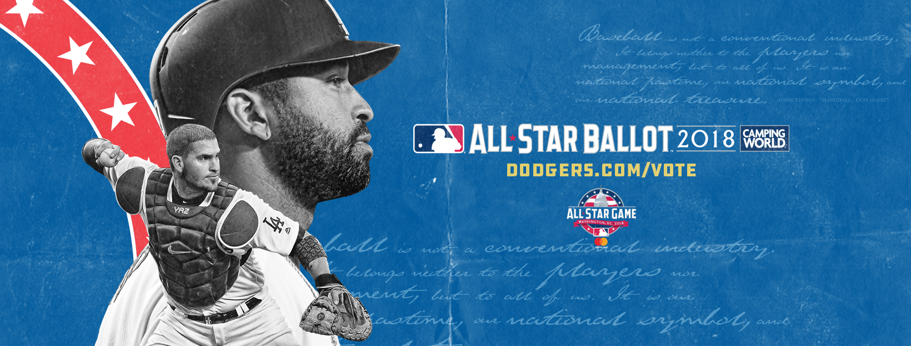

##what i did

***

I created the Los Angeles Dodgers' social media accounts' 'look' for the 2018 All-Star Game. This look was used across all social media platforms and was also incorporated into stadium-wide graphics seen on DodgerVision (aka, the Jumbotron).

##social media assets
***

##in the wild
***

https://twitter.com/Dodgers/status/1006235564738134016?

https://twitter.com/Dodgers/status/1013839642217537536

https://twitter.com/Dodgers/status/1016095768036274176

This included new social avatars, cover photos, voting updates and, eventually, announcment graphics for those lucky Dodgers who made the ASG squad.

##how i did it

***

Every year MLB provides a style guide to use for the All-Star Game and in 2018, since the game was being held in Washington D.C., it had a very D.C. vibe to the design. I incorporated those basic elements (the column illustrations, the Constitution-like text, etc.) into our design and added paper texture to give the look a little dimension. I also made sure to play up the Dodger blue just to be *extra sure* that our branding wasn't lost.