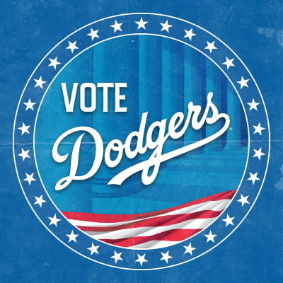

##what i did

***

I created the Los Angeles Dodgers' social media accounts' 'look' for the 2018 All-Star Game. This look was used across all social media platforms and was also incorporated into stadium-wide graphics seen on DodgerVision (aka, the Jumbotron).

##social media assets
***

##in the wild
***

<blockquote class="twitter-tweet">
Third in N.L. outfielder votes, first in our hearts.  Let&#39;s get <a href="https://twitter.com/TheRealMattKemp?ref_src=twsrc%5Etfw">@TheRealMattKemp</a> to the <a href="https://twitter.com/AllStarGame?ref_src=twsrc%5Etfw">@AllStarGame</a>! <a href="https://twitter.com/hashtag/VoteKemp?src=hash&amp;ref_src=twsrc%5Etfw">#VoteKemp</a>   🗳: <a href="https://t.co/HAWkr2ykIV">https://t.co/HAWkr2ykIV</a> <a href="https://t.co/x8KtX1PbCd">pic.twitter.com/x8KtX1PbCd</a>
&mdash; Los Angeles Dodgers (@Dodgers) <a href="https://twitter.com/Dodgers/status/1006235564738134016?ref_src=twsrc%5Etfw">June 11, 2018</a></blockquote>

<blockquote class="twitter-tweet">
.<a href="https://twitter.com/TheRealMattKemp?ref_src=twsrc%5Etfw">@TheRealMattKemp</a> surpasses 2 million votes in All-Star voting for N.L outfielders in the final update! Voting ends this Thursday. <a href="https://twitter.com/hashtag/VoteKemp?src=hash&amp;ref_src=twsrc%5Etfw">#VoteKemp</a>  🗳: <a href="https://t.co/SSqaZ6SgNN">https://t.co/SSqaZ6SgNN</a> <a href="https://t.co/BctRnJ0k6e">pic.twitter.com/BctRnJ0k6e</a>
&mdash; Los Angeles Dodgers (@Dodgers) <a href="https://twitter.com/Dodgers/status/1013839642217537536?ref_src=twsrc%5Etfw">July 2, 2018</a></blockquote>

<blockquote class="twitter-tweet">
BEAST MODE.   <a href="https://twitter.com/TheRealMattKemp?ref_src=twsrc%5Etfw">@TheRealMattKemp</a> is your N.L. starting outfielder for this year’s <a href="https://twitter.com/AllStarGame?ref_src=twsrc%5Etfw">@AllStarGame</a>! <a href="https://twitter.com/hashtag/LADetermined?src=hash&amp;ref_src=twsrc%5Etfw">#LADetermined</a> <a href="https://t.co/YOS3lU2yHh">pic.twitter.com/YOS3lU2yHh</a>
&mdash; Los Angeles Dodgers (@Dodgers) <a href="https://twitter.com/Dodgers/status/1016095768036274176?ref_src=twsrc%5Etfw">July 8, 2018</a></blockquote>

This included new social avatars, cover photos, voting updates and, eventually, announcment graphics for those lucky Dodgers who made the ASG squad.

##how i did it

***

Every year MLB provides a style guide to use for the All-Star Game and in 2018, since the game was being held in Washington D.C., it had a very D.C. vibe to the design. I incorporated those basic elements (the column illustrations, the Constitution-like text, etc.) into our design and added paper texture to give the look a little dimension. I also made sure to play up the Dodger blue just to be *extra sure* that our branding wasn't lost.