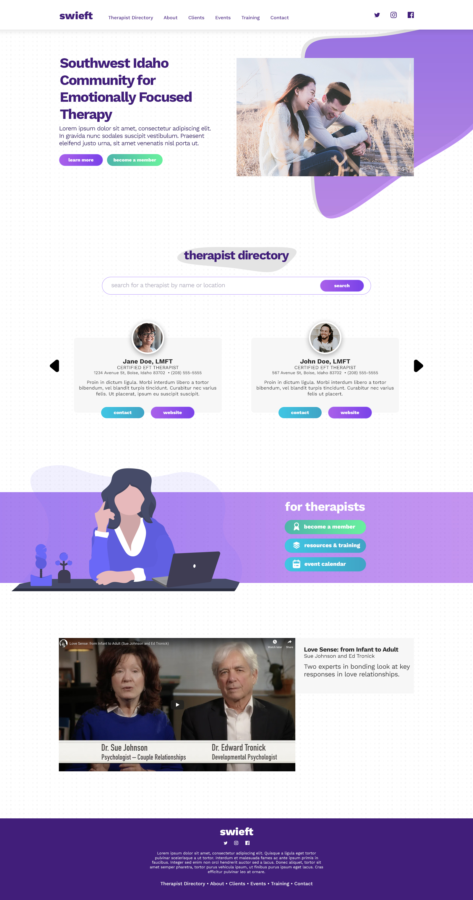
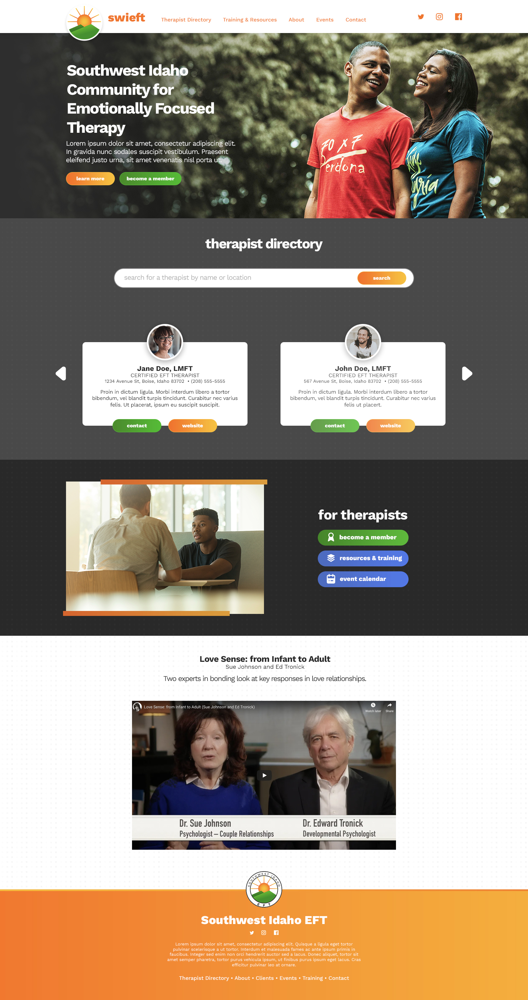

##what i did
                                
***

The Southwest Idaho Community for Emotionally Focused Therapy (SWIEFT) was looking for a brand-new website to attract new clients as well as therapists in the area.

I designed and built their website and I continue to provide support and direction.

**Technologies used**: Bootstrap, Joomla!, PHP, MySQL, jQuery, HTML, CSS

##how i did it

***

The client provided a basic content outline for their new website and I turned that into a wireframe.

From the wireframe, we moved to some design examples of the homepage. The client wanted it to stand out when compared to other websites in the EFT field. After some research, I determined that that meant the website should be a little more bold and bright.

Here is the initial homepage design that utilizes more of a modern look with the abstract shapes and illustrations:

The initial homepage design was done before a color palette was chosen based on their yet-to-be-created logo. Although they liked the purple in our initial design, the finished logo they provided did not include it. So, we went back to our original design, dropped the purple, used the colors from their logo and also decided to go with a darker body background in an effort to *really* differentiate the website from the others. Here's the approved design:

