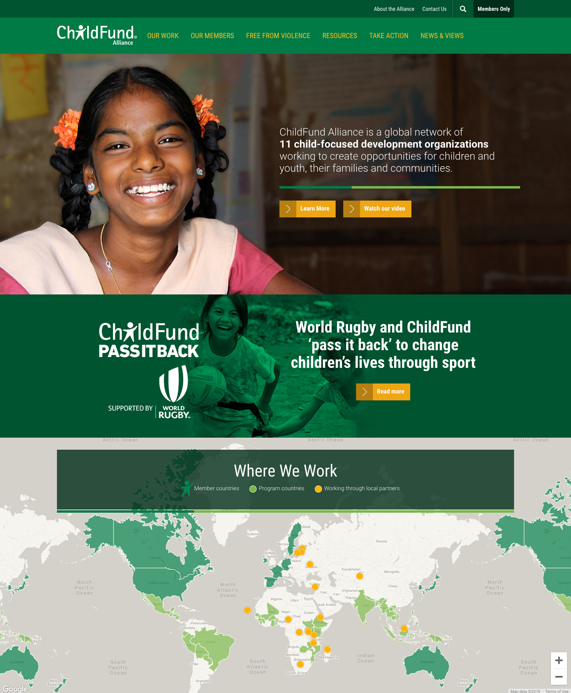

##what i did

***

The client wanted to move from a static approach to their homepage to a more dynamic one as they recently published a lot of new and relevant content.

Here's a screenshot of the homepage before the refresh:

..and after the refresh:

