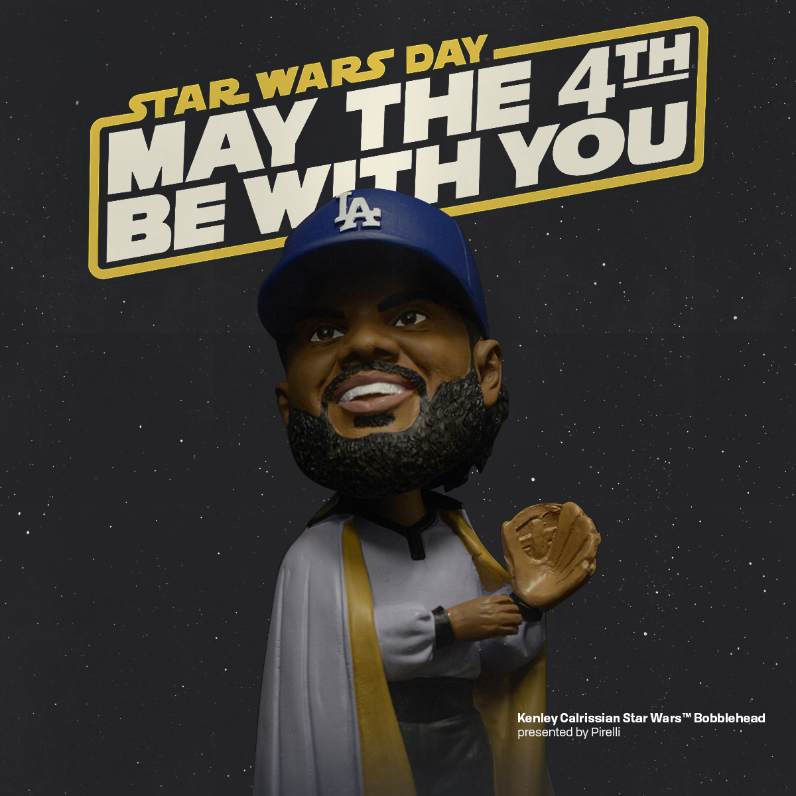
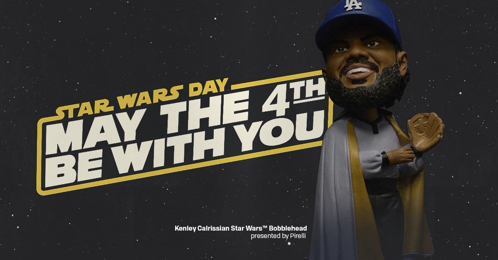
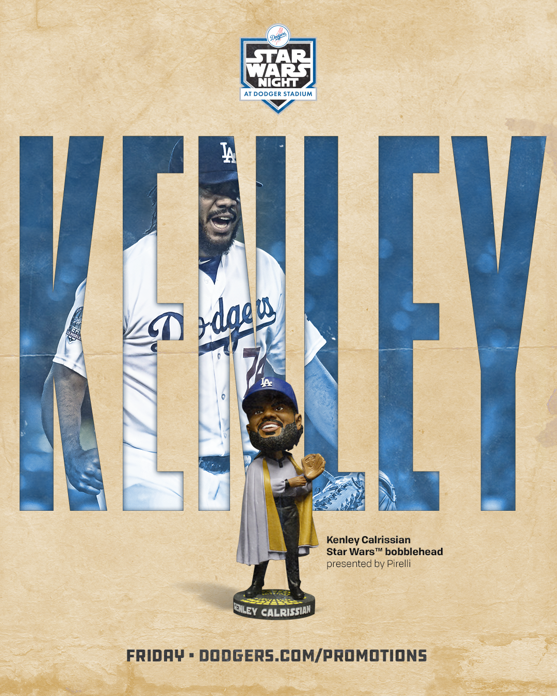

##what i did

***

Before we had our hands on an actual sample of the bobblehead, we had a mockup that we wanted to use to promote. The mockup, admittedly, wasn't the greatest work of art, so, I had to improvise. The above video was created using that mockup rendering from the vendor—I added the reveal in After Effects.

<blockquote class="twitter-tweet">
What have we here? It&#39;s my <a href="https://twitter.com/starwars?ref_src=twsrc%5Etfw">@StarWars</a> bobblehead, <a href="https://twitter.com/hashtag/KenleyCalrissian?src=hash&amp;ref_src=twsrc%5Etfw">#KenleyCalrissian</a>! ✨Get your <a href="https://twitter.com/hashtag/StarWars?src=hash&amp;ref_src=twsrc%5Etfw">#StarWars</a> bobble June 15. 🎟➡️ <a href="https://twitter.com/Dodgers?ref_src=twsrc%5Etfw">@dodgers</a> <a href="https://t.co/kDXrN5YOjd">https://t.co/kDXrN5YOjd</a> <a href="https://t.co/k9b0Os6lnD">pic.twitter.com/k9b0Os6lnD</a>
&mdash; Kenley Jansen (@kenleyjansen74) <a href="https://twitter.com/kenleyjansen74/status/971090736614539264?ref_src=twsrc%5Etfw">March 6, 2018</a></blockquote>

***

Once we got the actual sample, I photographed it and designed social graphics to use in our May the Fourth posts. Since I thought the bobblehead was super cool and one of the first themed bobbleheads that I can remember, I wanted the graphic to be pretty minimal and *scream* Star Wars&trade;.

***

Working with the folks over at Star Wars&trade; was so easy and they encouraged us to use their full suite of digital assets. This particular year, *Solo* was their next big project and they had these [awesome movie posters](https://lumiere-a.akamaihd.net/v1/images/solo-character-poster-han_1a145be9.jpeg?region=0%2C0%2C864%2C1280) that I wanted to 'borrow' for an upcoming post.

