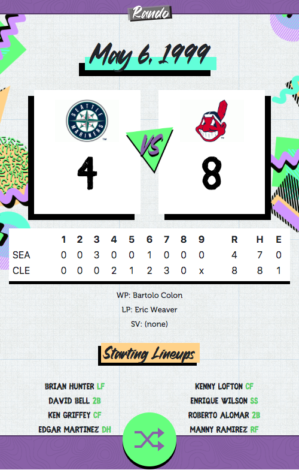

##what i did

***

I was fascinated with the [@HamiltonaDay](https://twitter.com/hamiltonaday) Twitter account and wanted to see if I could do something similar with baseball. So, I decided to build this proof-of-concept Twitter bot in PHP using a CronJob to Tweet out random baseball games from the 1990's.

Every day at 12 p.m. PST, [@RandoBasebot](https://twitter.com/RandoBasebot) will Tweet out a completely random game. The graphic that gets Tweeted out is generated on the fly and users can save the image if they follow the link in the Tweet.

https://twitter.com/RandoBasebot/status/1209202071028797443