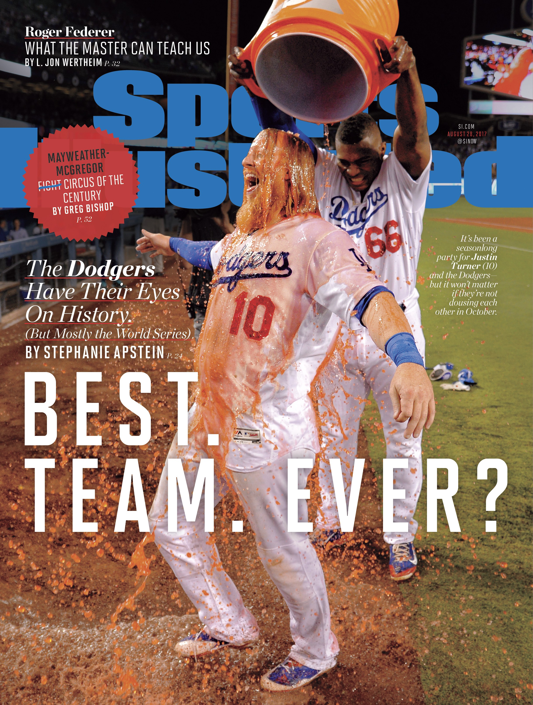

##what i did

***

I tend to want to do a little extra when the bare minimum is expected. Case in point this 2017 Sports Illustrated cover:

The cover caught most of us in the front office by surprise (even Justin Turner, he admitted to me later). Since Jon SooHoo, the team photographer, made this photo I knew I had the sequence of photos before the cover shot. I imported the photos into Photoshop, aligned the layers then exported to After Effects to add some motion.