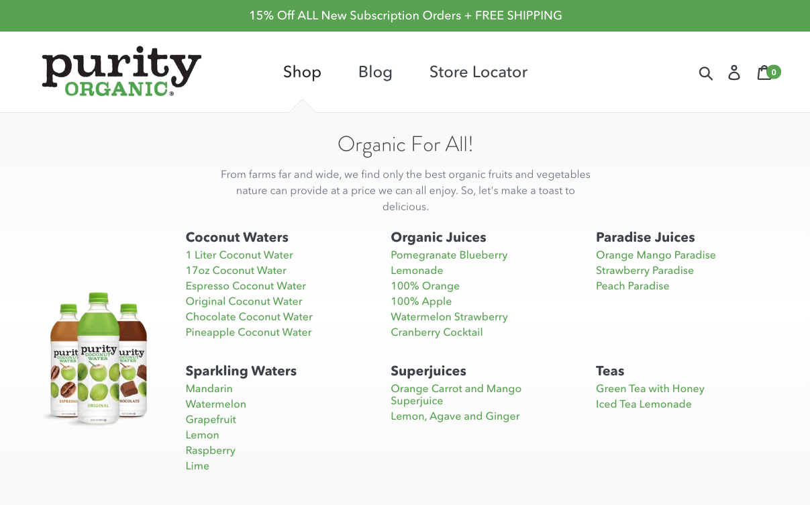
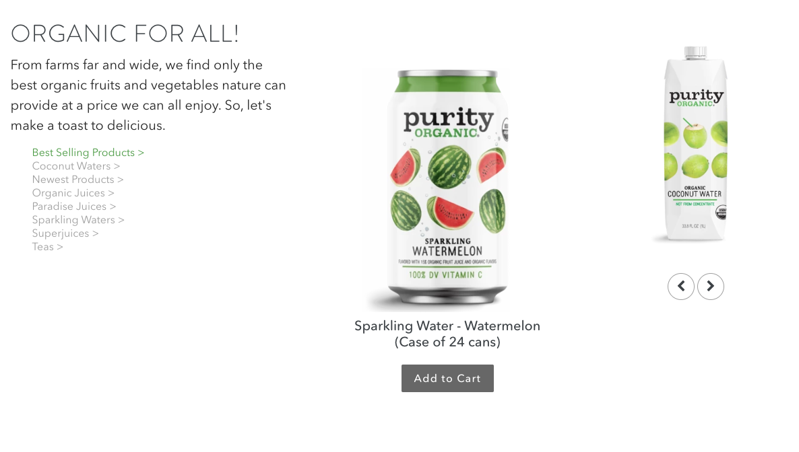
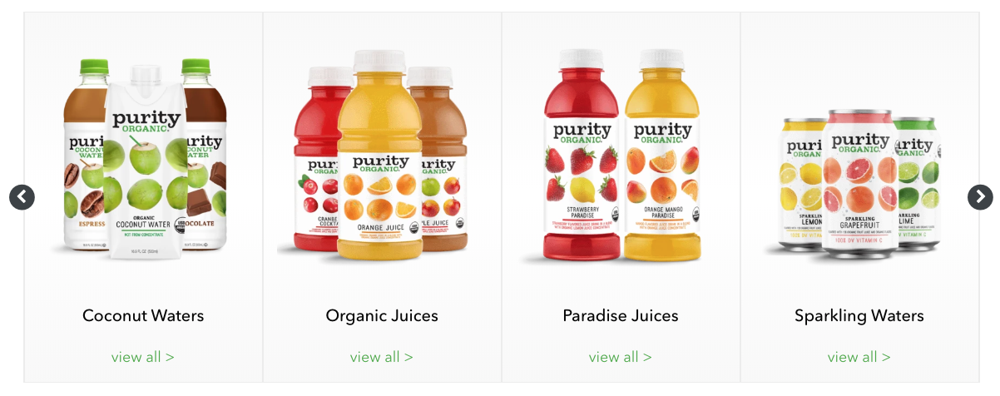

##what i did

***

Purity Organic was looking to update their current Shopify website and wanted a few custom components for their new homepage. All of these components are dynamically pulling in the categories and products from Shopify to make things super easy for the client.

##custom parallax

***

##custom navigation

***

I built a custom navigation to display a listing of products by category as well as an image of the product when a user hovers over an option.

##custom hero

***

##custom carousel

***

